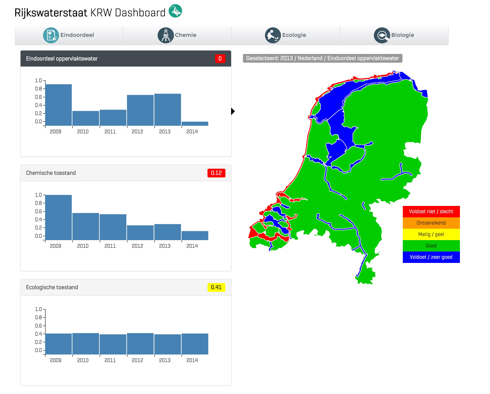

+++
date = "2015-10-30T10:10:15+01:00"
draft = false
title = "KRW Dashboard"
+++

## KRW Dashboard

<i class="fa fa-download"></i>&nbsp;<a href="../files/Informatieblad-KRW.pdf">Informatieblad</a>

Om inzicht te krijgen in de ecologische en fysisch-chemische waterkwaliteit wil je vanuit het grotere geheel kunnen inzoomen naar relevante details. Om dit proces voor de KRW te ondersteunen is het KRW Dashboard ontwikkeld. Door de generieke configuratie is het Dashboard ook geschikt om het voor andere doelen dan KRW in te zetten.

## Aanleiding

Rijkswaterstaat heeft Nelen & Schuurmans gevraagd hun visie op visualisatie van ecologische en fysisch-chemische waterkwaliteitsinformatie uit te werken. Hieraan hebben we invulling gegeven door een KRW Dashboard in te richten. Dit KRW Dashboard is een prototype en is gevuld met gegevens uit het KRW portaal en met dummy data.

## Impressie

(volgt)